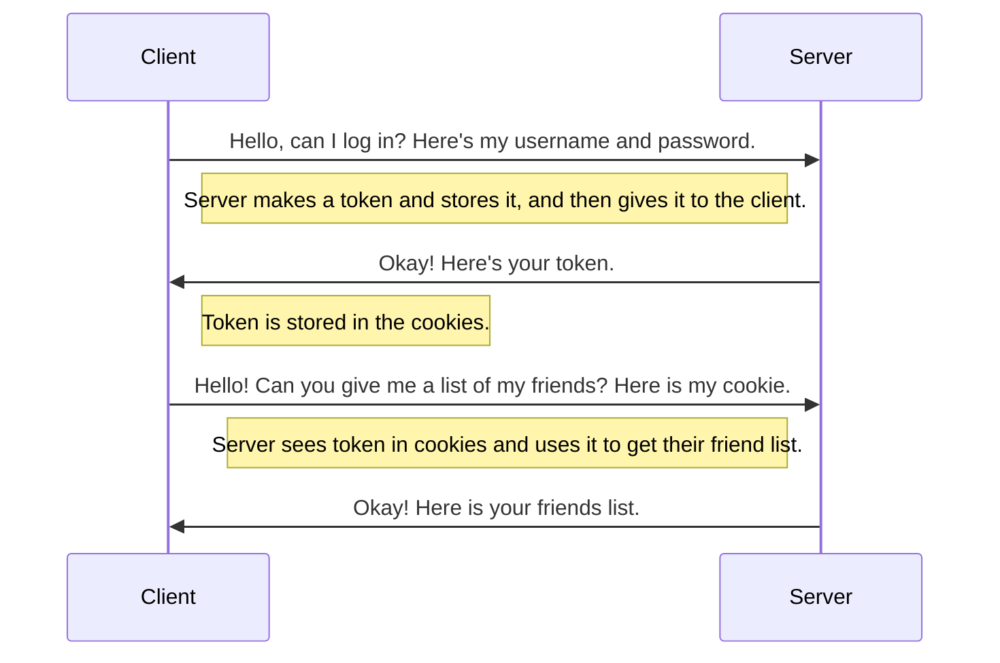
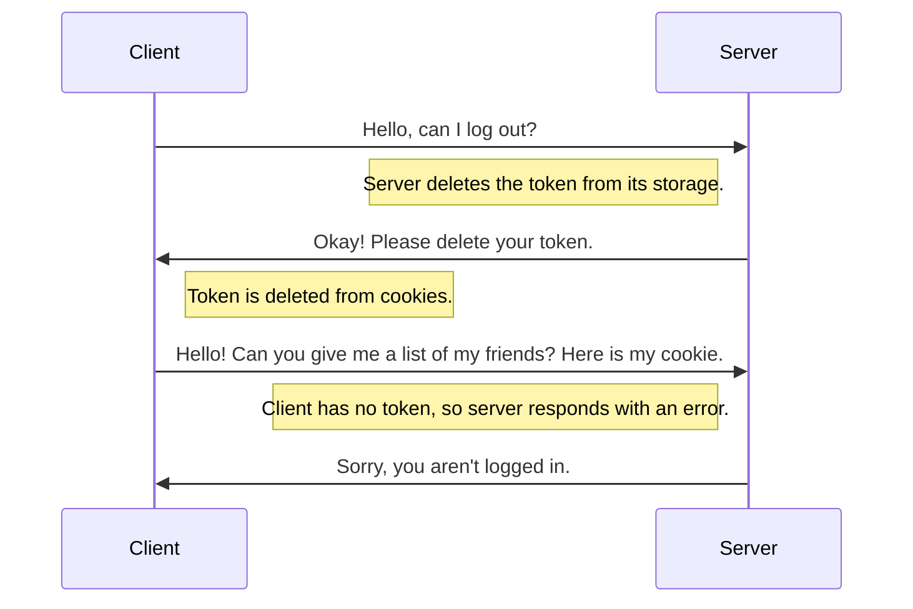

# The .ROBLOSECURITY Token

When you log in on the Roblox website, you create a new session with a special identifier linked to it, and that token is stored on your computer as a cookie.
Every single time your computer asks Roblox to do anything - for example, "give me the name of this user" - your computer also gives this token to Roblox, and it can look and see if that token is valid.  

Let's say you're asking Roblox to give you a list of your friends. It'll look at that token and know who you are, and can use that to give you your friends list.

When you log out, that token is invalidated. Even if the client holds on to the token, it won't be valid after logging out.

This token is called the `.ROBLOSECURITY` token and you will need one to do anything that you need to be logged in to do on Roblox, including:  

- getting information about yourself (name, description, id, etc)  
- changing avatar  
- getting friends list  
- playing games  

